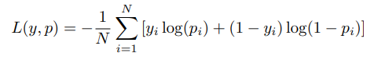

## Linear Regression

A linear classifier for a binary classification task using three different pairs of datasets is being implemented. The three pairs of datasets are used for training and testing purposes. Each dataset contains multiple data points, with rows representing individual data points and three columns: The first two columns correspond to the features of each data point. The third column is the label, which is either 1 or 2.

The entire implementation is split in four parts-

# Part A

Here the datasets are loaded, pre-processed and converted into NumPy arrays. Next the labels are separated from the features and converted into {0,1} from {1,2}. This is done keeping in mind the involvement of the loss function in later stages. At the end of part A both the label and feature arrays are converted into PyTorch tensors.

# Part B

In part B, a loss function is defined that takes the true labels and predicted probabilities, and returns the loss value. Defining an appropriate loss function is essential for good model performance. For this example, a cross-entropy loss function is used. The formula is given by: 

      

where:
 
    • N is the number of data points

    • yi is the true label of the i-th data point

    • pi is the predicted probability for the i-th data point

This formulation of the cross-entropy loss is valid for binary labels in {0, 1}.This is why we need to convert the labels accordingly. Since yi ∈ {0, 1} and 0 < pi < 1, the loss function is always positive.

probability pi is calculated by the model prediction procedure as follows: 
            

.png)

However, when using the cross-entropy loss function, we need to convert these predictions to probabilities pi ∈ (0, 1). This is done using the non-linear sigmoid activation function:
            

.png)

For optimization, stochastic gradient descent (SGD) with momemtum is utilized, with learning rate of 0.01

# Part C and Part D

Here the network is trained on 100 epochs, with forward propagation, loss calculation, backpropagation using gradient descent and weight updation. At the end we test the network with a test_dataset.csv and calculate the averaged accuracy between the outputs and their corresponding labels. 

After training and testing results show that dataset 1 receives 100% accurancy as the datapoints are linearly separable, dataset 2 has some noise and thus results in 96% accuracy. Dataset 3 has the least accuracy (72%) as the datapoints are not linearly separable.